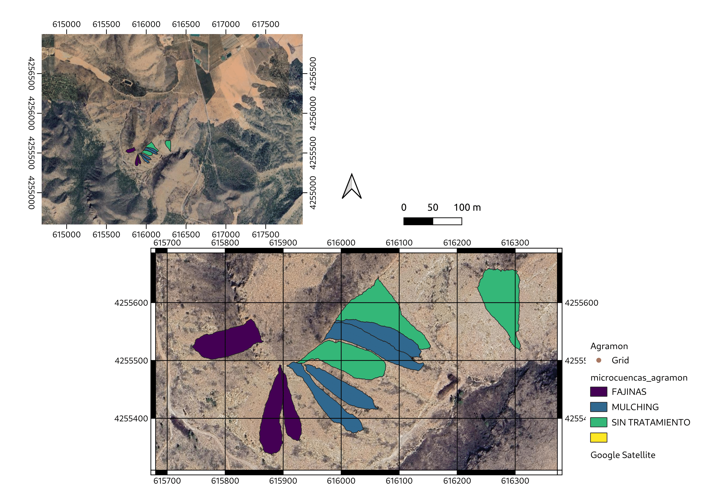



## Agramon (2019)

<video width="600" controls muted autoplay loop playsinline>
  <source src="../images/agramon_compressed.mp4" type="video/mp4">
  Your browser does not support the video tag.
</video>

*Credit: Gustavo A. Mesias Ruiz (ICA-CSIC)*

Immediately after the fire, various post-fire management strategies were implemented in September and October 2012 by forest managers of the regional government. These included hillslope stabilization techniques such as **Log Erosion Barriers (LEBs)** and **Contour-Felled Logs (CFD)**.

